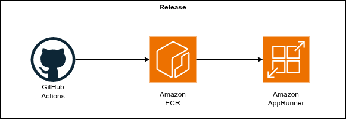

## Simple addition API

# Overview

A simple Python based web api that will conviniently add two integers for you!

It uses FastAPI web framework which was chosen because it is very simple and looks similar to Spiring boot. For testing we are using pytest.

# CI/CD

In order to facilitate fast development and deployment we are using GitHub Actions.
There are two pipelines

- [Unit test & Build](.github/workflows/unit-test-and-build.yml)
- [Release](./.github/workflows/release.yml)

## Development pipeline (Unit test & Build)

Once you open a PR on this repository a job will be triggered that will run unit tests and build the docker image just as a syntax check for the Dockerfile

## Release pipeline (Release)

The second job is a release pipeline that will get triggered once you merge to `main`

The Release job will trigger an action that will run unit tests again, build the image and additionally push it to Elastic Container Registry on my personal AWS account.

The API should be available on the link below -

https://nwrpeamxcf.eu-west-1.awsapprunner.com/add?left=5&right=-15

_Note : The GitHub integration, AppRunner and ECR were manually created, not managed as code_

### Ideas for improvement 

- Defining infrastructure entirely as code in CloudFormation or terraform (like GitHub role, App Runner and so on)

- A fully serverless approach where we run a Lambda function with Python code + API Gateway in front of it would be functionally the same but more minimal with less overhead since we're not managing containers.
